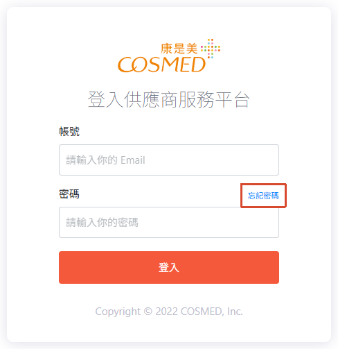

# IMS 通路版 - 供應商服務平台

## 一、簡介

### 1. IMS 功能介紹

IMS(Inventory Management
&#x20;System) 通路版是提供給供應商的商品與訂單管理後台，供應商可透過此後台完成賣場建立、上架到通路商(康是美)官網、管理可賣量並進行訂單履約的完整流程。後台功能主要涵蓋四大模組：

* **商品與賣場管理**：供應商可單筆或批次建立「商品主檔」，並將商品轉出成「賣場檔」（一個 IMS 賣場檔對應一個官網商品頁），完成編輯後送出上架提報，經通路商(康是美)審核通過即會在官網建立商品頁供消費者下單。已上架的賣場如需修改資料或售價，則須另外發起「賣場異動提報」由通路商(康是美)審核；唯獨「可賣量」欄位可直接修改、無須審核。
* **庫存管理**：供應商可即時查詢與修改商品可賣量，並可查詢可賣量的修改歷程。
* **訂單與出退貨管理**：可查詢訂單狀態、進行宅配出貨的物流資訊填寫，以及處理退貨作業。
* **報表與系統功能**：提供對帳報表匯出下載，以及「批次作業中心」統一管理各類批次匯出（如 賣場資料 / 賣場售價 / 可賣量查詢......等）、批次匯入（如 批次修改賣場資料 / 批次修改賣場售價 / 批次修改賣場可賣量......等）的執行結果。

IMS 通路版為「供應商（下游，負責提報）」與「通路商（上游，負責審核）」之間的溝通橋樑，所有商品上架與異動都需經過供應商提報、通路商(康是美)審核通過後，才會同步更新到通路商(康是美)官網商品頁，確保商品資訊正確呈現給消費者並提供販售。

### 2. 賣場上架/異動流程總覽

<figure><figcaption></figcaption></figure>

## 二、名詞說明

### 1. 商品 / 賣場相關

<table data-header-hidden data-header-sticky><thead><tr><th width="165">名詞</th><th>說明</th></tr></thead><tbody><tr><td><strong>名詞</strong></td><td><strong>說明</strong></td></tr><tr><td>商品主檔</td><td>商品的基本資訊，可多次轉出賣場檔；與賣場檔的編輯內容互不同步。</td></tr><tr><td>賣場檔</td><td>
從商品主檔轉出而成，需填寫對應資料才能正式上架提報。一個 IMS 賣場檔 = 一個官網商品頁，上架與異動都是對賣場檔操作。 

賣場檔狀態變更流程：
<ul><li>商品主檔 →（儲存並轉出賣場檔）→ <strong>賣場檔 </strong><mark style="background-color:$info;"><strong>草稿</strong></mark></li><li>賣場檔 →（轉為編輯完成）→ <strong>賣場檔 </strong><mark style="background-color:green;"><strong>編輯完成</strong></mark></li><li>賣場檔 →（上架）→ （審核通過）→ <strong>賣場檔 </strong><mark style="background-color:orange;"><strong>已上架</strong></mark>：消費者可在官網商品頁下單結帳</li></ul></td></tr><tr><td>IMS 商品</td><td>只存在於 IMS 的商品主檔。</td></tr><tr><td>IMS 賣場</td><td>對應 OSM 商品頁的賣場。</td></tr><tr><td>SPU ID</td><td>標準產品單位（Standard Product Unit），商品有選項時為必填，不可重複。</td></tr><tr><td>貨號</td><td>庫存單位 SKU（Stock Keeping Unit），無論商品有無選項皆須填寫，不可重複。</td></tr></tbody></table>

### 2. 提報單相關

<table data-header-hidden><thead><tr><th width="165">名詞</th><th>說明</th></tr></thead><tbody><tr><td><strong>名詞</strong></td><td><strong>說明</strong></td></tr><tr><td>上架提報單</td><td>在賣場檔第一次點擊「上架」後產生，經通路商(康是美)審核通過才會在官網建立商品頁，消費者才能下單結帳。</td></tr><tr><td>異動提報單</td><td>賣場已上架後，若要修改資料 / 售價時產生，經通路商(康是美)審核通過才會在官網更新商品頁，消費者才能看到異動後的內容。</td></tr><tr><td>賣場資料提報單</td><td>僅支援修改售價以外的資料欄位，同時僅能存在 1 張未結案的賣場資料提報單，通路商(康是美)審核通過後會立即更新賣場資料。</td></tr><tr><td>賣場售價提報單</td><td>僅支援修改賣場名稱、圖片、售價、詳細說明，可預約時間，同時可存在多張賣場售價提報單，通路商(康是美)審核通過後會立即 / 於指定時間更新賣場資料。</td></tr><tr><td>可賣量</td><td>即庫存 / 可販售數量，是唯一「賣場已上架後能直接修改、不用經過審核」的資料欄位。</td></tr></tbody></table>

### 3. 其他

<table data-header-hidden><thead><tr><th width="165">名詞</th><th>說明</th></tr></thead><tbody><tr><td><strong>名詞</strong></td><td><strong>說明</strong></td></tr><tr><td>上游 / 下游</td><td>上游 = 康是美（負責審核）；下游 = 供應商（負責提報）。</td></tr><tr><td>單筆</td><td>於介面直接操作。</td></tr><tr><td>批次</td><td>下載 Excel 範例檔，填寫後整筆匯入，透過「批次作業中心」查詢執行結果。</td></tr></tbody></table>

## 三、使用說明

### 0. 登入與查看使用手冊

#### 0.1 登入供應商服務平台

* 登入網址：[https://ims.cosmed.com.tw/](https://ims.cosmed.com.tw/)
* 登入帳號：使用者 email  <mark style="color:$danger;">\*如需新增使用者，請通知通路商(康是美)協助申請開通帳號</mark>
* 登入密碼：預設為 00000，可透過 \[忘記密碼] 重設(如下圖)

<figure><figcaption></figcaption></figure>

#### 0.2 使用手冊功能路徑

在供應商服務平台的右上角，可以分別前往：批次作業中心 / 操作手冊 / 公告通知。

畫面截圖：供應商服務平台 Header 導覽

### 1. 商品管理

商品主檔管理：建立商品、轉出賣場。賣場管理：編輯賣場、上架賣場。供應商上架提報單：查看上架審核狀態。

#### 單筆新增商品、複製商品、修改貨號、贈品建檔

若要上架商品，需要先在「商品主檔管理」建立商品主檔，可從 \[商品 > 商品主檔管理] 頁面點擊 \[新增商品]。點擊「儲存」才會建立商品，未儲存直接關閉頁面則不建立。

畫面截圖：商品主檔管理查詢頁、新增商品編輯頁

商品的必填欄位（完整表格）

基本資訊／商品主圖

| 區塊   | 標題    | 必填            | 限制        |
| ---- | ----- | ------------- | --------- |
| 基本資訊 | 商品名稱  | 必填            | 160 字     |
| 基本資訊 | 特色標題  | 必填            | 20 字      |
| 基本資訊 | 商品特色  | 必填            | 400 字     |
| 基本資訊 | 銷售重點  | 必填            | 400 字     |
| 基本資訊 | 商品來源  | 必填            | —         |
| 基本資訊 | 履約模式  | 必填            | —         |
| 基本資訊 | SPU編號 | 多選項時必填／無選項非必填 | 30 字，不可重複 |
| 基本資訊 | 原廠型號  | 必填            | —         |
| 基本資訊 | ERP分類 | 必填            | —         |
| 商品主圖 | 圖片    | 必填            | 10 張      |
| 商品主圖 | 影片    | 必填            | 1 則       |

銷售資訊／詳細說明／商品分類／規格／SEO

| 區塊    | 標題                         | 必填 | 限制            |
| ----- | -------------------------- | -- | ------------- |
| 銷售資訊  | 銷售開始/結束日期                  | 必填 | 日期格式          |
| 銷售資訊  | 預購類型／指定到貨日期                | 必填 | 日期格式          |
| 銷售資訊  | 溫層類別／是否免稅／商品材積             | 必填 | —             |
| 詳細說明  | 新增影片                       | 必填 | 1 則           |
| 詳細說明  | 詳細說明內文                     | 必填 | 10,000 字      |
| 商品分類  | 商品品類／商店類別                  | 必填 | —             |
| 商品規格  | 商品規格                       | 必填 | 僅全形符號         |
| SEO設定 | title／keywords／description | 必填 | 120／120／400 字 |

商品選項

| 標題                           | 必填 | 限制         |
| ---------------------------- | -- | ---------- |
| 商品選項／規格／圖片                   | 必填 | —          |
| 國際條碼                         | 必填 | 200 字，可重複  |
| 貨號                           | 必填 | 200 字，不可重複 |
| 建議售價／售價／成本／可賣量／安全庫存量／一次最高購買量 | 必填 | 僅能整數       |

貨號一定要填；若商品為多選項，SPU 編號也必填。其他欄位填好後，轉出賣場時會直接帶入賣場檔。

多選項商品：如何設定選項資料

編輯商品時，若該商品是多款多色，可在 \[商品選項] 先勾選 \[有選項]：① 選擇「有選項」→ ② 填入階層 → ③ 填入選項資料。

畫面截圖：設定商品選項階層與內容

半形／全形符號規則

「商品選項規格」「商品規格」的欄位名稱與內容只能輸入**全形符號**，不能輸入「: ; , <>」等半形符號。若透過批次功能新增，分隔請用半形「:」，例如商品規格填「材質:有機棉」，二階賣場選項填「紅色:XL」。

畫面截圖：商品規格欄位全形符號範例

轉出賣場後才發現資料填錯，怎麼辦？

商品主檔轉出賣場檔後，除了「貨號、SPU ID」以外，在商品主檔修改的資料都**不會同步**到已轉出的賣場檔。若賣場尚未送審，可以刪除剛才轉出的賣場檔，回商品主檔重新編輯後再轉出一次。支援直接點擊前往對應賣場檔。

畫面截圖：轉出賣場檔後的商品頁提示

複製商品：哪些欄位會被複製？

點擊列表的「複製」按鈕即可。商品名稱最後面會自動加上「- 複製」；**序號類欄位（SPU、貨號、國際條碼）一律不複製**，其餘欄位皆會複製。

畫面截圖：商品列表「複製」按鈕

修改貨號

從「商品主檔」修改貨號後，儲存即會**同步修改**對應賣場、以及過往所有訂單的貨號，此步驟不須審核。

畫面截圖：商品列表編輯入口、貨號修改欄位

贈品建檔怎麼做？

| 情境         | 建檔方式                                                                                                |
| ---------- | --------------------------------------------------------------------------------------------------- |
| 僅作為活動贈品    | 依正常做法建商品/賣場；商品名稱統一「贈品-商品名稱」（如：贈品-洗手乳）；贈品可賣量一律為 0；匯出賣場檔時隱賣商品需修改為是。由 MD 提供贈品通路賣場ID、商品料號、庫存供康是美店長設定活動。 |
| 贈品同時當正常品販售 | 需建立兩個賣場（一個贈品、一個正常品），各自依上述規則建立。                                                                      |

畫面截圖：贈品隱賣商品設定欄位

#### 批次新增商品、編輯商品資料、編輯商品選項、上傳商品主圖

批次新增商品：範例檔規則

在 \[商品主檔管理] 點擊 \[批次新增商品] 下載 Excel 範例檔。檔案限制 xlsx，單檔 10MB，筆數上限 **50,000 筆**。藍色欄位必填，勿更改工作表名稱／欄位名稱。履約模式請填「預設倉履約」。不可重複新增相同貨號。若商品已存在 IMS，此功能不支援新增選項（僅可從介面單筆新增）。

必填欄位：貨號、履約模式、商品選項。延伸欄位（商品選項＝「有選項」才需填）：SPU編號、規格1、詳細規格1。

畫面截圖：下載批次新增商品範例檔、範例檔欄位填寫示意

批次新增商品：常見錯誤訊息

* 貨號：貨號重複／貨號已建檔過
* 履約模式：相同SPU編號，履約模式須相同
* SPU編號：商品選項為「有」但未填SPU編號／SPU編號已建檔過
* 新增影片(商品主圖)：影片連結開頭不是 youtu.be
* 規格1／詳細規格1：同SPU規格須相同、不可重複；商品選項為「無」不可填規格
* 銷售開始/結束日期：格式錯誤；商品材積：須為正整數；91APP商品品類/商店類別：錯誤

畫面截圖：批次作業中心匯入結果、錯誤回檔範例

批次編輯商品資料：可修改欄位

檔案限制 xlsx，單檔 10MB，筆數上限 2000 筆。**上傳後會整筆覆蓋**，欄位留空會被清空。**不支援**修改：SPU編號、商品選項、商品選項規格/圖片、國際條碼、貨號——若要新增規格或改貨號/SPU，須從介面單筆操作。其餘基本資訊、銷售資訊、詳細說明、商品分類、規格、SEO、售價/成本/可賣量等欄位皆可修改。

畫面截圖：批次編輯商品資料：匯出範圍設定、上傳編輯後的 Excel

批次編輯商品選項：修改 vs 新增

**修改商品選項**：可改「詳細規格1、詳細規格2、選項順序」（例：銀色→星鑽銀）。**新增商品選項**：可針對一階或二階商品新增選項，SPU、階層須符合原有格式。

不支援修改「商品名稱、SPU、貨號、規格1、規格2」本身。

畫面截圖：匯出商品選項、修改／新增選項示意

批次上傳商品主圖：兩種命名方式

**方法一：資料夾分類** — 1 個資料夾 = 1 項商品，資料夾命名為 SPU ID（有選項）或貨號（無選項），內放 1\~10 張圖。

**方法二：檔名分類** — 圖片命名為「SPU ID\_1~~10」或「貨號\_1~~10」，不需資料夾分層。

共同規則：Zip 檔 10KB–100MB；每張圖 10KB\~300KB、500x500px 以上（建議 1000x1000 可放大檢視）；格式 PNG/JPG/GIF；檔名限英數字。**上傳的主圖會完全覆蓋原有主圖**，數量變少會自動刪除多餘的。

畫面截圖：批次上傳商品主圖入口、方法一：資料夾命名結構、方法二：檔名命名結構

#### 賣場管理：編輯賣場、上架賣場

商品轉出賣場檔後即可從「賣場管理」查詢到（未上架/已上架皆可查），點擊「編輯」進入賣場頁。

畫面截圖：賣場管理查詢列表

**賣場上架流程**

草稿

→點「轉為編輯完成」→

編輯完成

→點「上架」→

提報審核中

→通路審核通過→

已上架（官網可見）

畫面截圖：賣場頁：上架設定、賣場管理：上架狀態變更

賣場上架的必填欄位（完整表格）

基本資訊／商品主圖

| 標題      | 必填        | 限制    |
| ------- | --------- | ----- |
| 商品名稱    | 必填        | 160 字 |
| 商品特色    | 選填        | 20 字  |
| 銷售重點    | 選填        | 400 字 |
| 商品主圖    | 必填        | 10 張  |
| 影片／影片位置 | 若放影片則位置必填 | 1 則   |

銷售資訊／詳細說明／分類／規格／SEO

| 標題                             | 必填 | 限制                                                     |
| ------------------------------ | -- | ------------------------------------------------------ |
| 銷售開始/結束日期、交期、指定到貨日期、溫層類別、隱賣商品  | 必填 | 日期格式                                                   |
| 商品材積／是否可退貨                     | 選填 | —                                                      |
| 詳細說明內文                         | 選填 | 「50,000 − 自訂內容字元數」動態上限（例：自訂內容 3,696 字元 → 上限 46,304 字元） |
| 商品品類／商店類別                      | 必填 | —                                                      |
| 商品規格                           | 選填 | 僅全形符號                                                  |
| SEO title／keywords／description | 選填 | 120／120／400 字                                          |

商品選項

| 標題                           | 必填 | 限制         |
| ---------------------------- | -- | ---------- |
| 商品選項／規格                      | 必填 | —          |
| 國際條碼                         | 必填 | 200 字，可重複  |
| 商品料號                         | 必填 | 200 字，不可重複 |
| 外部自訂編號                       | 選填 | 200 字      |
| 建議售價／售價／成本／可賣量／安全庫存量／一次最高購買量 | 必填 | 僅能整數       |

⚠️ 2026/07/08 上線：「詳細說明內文」新增字元上限檢核＝「50,000 − 自訂內容字元數」。中文/全形符號每字 2 字元，英文/數字/半形符號（含 HTML 標籤）每字 1 字元，計算「原始碼」內容。檢核時機：賣場管理單筆/批次「轉為編輯完成」「上架」，以及賣場異動管理送審時。超過會顯示「詳細說明不可超過 {N} 字元」。

備註：從賣場檔修改資料，並不會同步修改商品主檔的欄位，反之亦然。

賣場已上架後，還能直接改資料嗎？

不行。已上架賣場此頁**無法直接修改資料**，須點右上角「新增賣場異動提報」送審。唯獨**可賣量不須審核**，可直接在「可賣量查詢」頁修改。

畫面截圖：已上架賣場頁：新增賣場異動提報入口

#### 供應商上架提報單

畫面截圖：供應商上架提報單列表、提報單內容詳情

可查看所有賣場的上架提報單狀態。僅「審核狀態＝待審核」可以取消提報，取消後賣場狀態回到「編輯完成」，需重新點「上架」才能再次送審。

若被**審核拒絕**：至「賣場管理」用「上架狀態」篩選出「審核拒絕」，進入賣場頁重新編輯後再次上架。

### 3. 賣場異動管理

賣場一旦上架，任何資料或價格的修改都必須透過「異動提報單」送審，通路審核通過後才會更新到官網。

#### 新增賣場異動提報：兩種提報單怎麼選？

畫面截圖：新增賣場異動提報：查詢已上架賣場、單筆／批次提報方式

| 提報類型     | 建立方式                            | 更新模式          | 提報單可修改欄位             | 提報單限制                     |
| -------- | ------------------------------- | ------------- | -------------------- | ------------------------- |
| **賣場資料** | 單筆：新增賣場異動提報／批次：批次修改賣場資料、主圖、新增選項 | 支援立即更新        | 可改 21 個資料欄位，**不含售價** | 一次只能一張「未結案」提報單            |
| **賣場售價** | 單筆：新增賣場異動提報／批次：批次修改賣場售價         | 支援立即更新／支援預約更新 | 售價、賣場名稱、賣場主圖、詳細說明    | 預約更新：同一時間僅一張未結案單；立即更新：可多張 |

💡 一次只能有一張未結案的「賣場資料提報單」；「賣場售價提報單」則可用預約時間分開發多張。

#### 賣場資料提報單

畫面截圖：賣場資料提報單編輯畫面、送審後檢視模式（異動標籤）

可修改：上架後售賣狀態、賣場名稱、商品特色、銷售重點、商品主圖/影片、新增選項、銷售開始/結束日期、交期、詳細說明、商品分類、商品規格、SEO 設定。

編輯完成點「儲存」或「送審」。**送審後不可重新編輯**，若需更新內容，須先「取消提報」再重新發起新的提報單。有異動的欄位會標註「異動」標籤方便辨識。

#### 賣場售價提報單

畫面截圖：賣場售價提報單編輯畫面、送審後檢視模式（漲跌價色碼）

可修改：預計異動時間、異動備註、賣場名稱、商品主圖、建議售價/售價/成本、詳細說明內文。

欄位填寫規則

* 賣場名稱最多 160 字
* 新建議售價 ≥ 新售價 ≥ 新成本 ≥ 0
* 預計異動時間格式 YYYY/MM/dd hh:mm，須大於現在 30 分鐘、須為整點
* 異動備註最多 20 字

預約異動時間規則

指定異動時間須大於現在 30 分鐘（例：要預約 04/01 12:00，最晚 04/01 11:30 前送審）。**相同賣場同一時間僅能一張預約單**；**相同賣場 1 小時內僅能一張預約單**。

送審後可看「異動」標籤比對新舊售價：紅字＝漲價（超過 20% 額外黃底）、黑字＝不變、綠字＝降價（超過 20% 額外黃底）。

#### 供應商異動提報單：狀態機與各狀態可做的操作

畫面截圖：供應商異動提報單查詢、審核拒絕原因、更新失敗原因

| 審核狀態                                  | 供應商可做    | 通路可做      |
| ------------------------------------- | -------- | --------- |
| 尚未送審僅資料單有此狀態                          | 編輯、送審、刪除 | 看不到（尚未送審） |
| 待審核                                   | 取消提報     | 審核通過／審核拒絕 |
| 審核中                                   | 無法操作     | 無法操作      |
| 審核通過/待更新（>30分）                        | 無法操作     | 可再次審核拒絕   |
| 審核通過/待更新（≤30分）／更新中／已更新／更新失敗／審核拒絕／取消提報 | 無法操作     | 無法操作      |

供應商建立提報單

→

待審核

→通路審核通過→

審核通過/待更新

→(無預約)立即更新／(有預約)時間到→

更新中 → 已更新

「更新失敗」只代表**特定欄位**沒更新成功，其餘有異動的欄位仍會成功更新，可在查詢介面看到失敗原因。

#### 批次售價／主圖／資料／新增選項／外部編號

批次修改賣場售價

先至「新增賣場異動提報」匯出「售價報表」，填寫後從「批次修改賣場售價」匯入。檔案限制 xlsx，單檔 10MB，上限 2000 筆。若要一併改主圖，須改匯入 Zip（Excel + 圖片資料夾，資料夾名＝賣場序號）。

* 賣場名稱最多160字元；詳細說明最多 32,767 字元（Excel 本身限制）
* 新建議售價 ≥ 新售價 ≥ 新成本 ≥ 0
* 預約時間需整點、大於現在 30 分鐘；相同賣場同一時間/1小時內僅能一張預約單

情境提醒：若 Zip 內只要改主圖，請改用「批次修改賣場主圖」；同一賣場若售價正確但主圖有誤，整張都不會建立提報單，需一起修正後重新匯入。

畫面截圖：匯出售價報表、編輯售價 Excel

批次修改賣場主圖

先到「賣場管理」匯出「賣場所有資料」取得賣場序號，Zip 內資料夾命名＝賣場序號（主圖）／SkuImage（選項圖，圖名＝貨號）。主圖每賣場最多 10 張，10KB\~300KB，500x500 以上；選項圖 400x400 以上。上傳會完全覆蓋原主圖。

畫面截圖：下載 Zip 範例格式、匯出賣場所有資料

批次修改賣場資料

先匯出「資料報表」再編輯匯入。欄位規則：**要改**→填新內容；**不改**→留空；**改成空值**→填「清空」。單檔 10MB，上限 2000 筆。

**詳細說明含圖片**的更新方式有兩種：① 若圖片來自 IMS 後台上傳，需先單筆上傳新圖到商品主檔取得新網址，再複製貼到賣場 Excel；② 若用圖床網址，可直接在 Excel 修改網址。

畫面截圖：匯出賣場資料報表、編輯賣場資料 Excel

批次新增商品賣場選項

一層選項直接填新內容（如「橘」）；二層選項用半形冒號分隔（如「橘:L」）。**僅能依照原賣場的選項規則新增**：無選項賣場不可新增選項；一階賣場只能加一階；二階賣場只能加二階。匯入成功會建立「賣場資料」提報單。

畫面截圖：下載新增賣場選項範例、編輯選項內容 Excel

批次修改賣場外部自訂編號

先到「賣場管理」匯出「外部自訂編號」再編輯匯入。**此功能不會建立提報單**，匯入成功即直接更新，無需審核。

畫面截圖：匯出外部自訂編號、編輯外部自訂編號 Excel

#### 提報單常見問題（7 則）

Q1：賣場已上架，能否直接從商品主檔或賣場檔改資料/售價？

不行，一律要走異動提報單：改售價用「批次修改賣場售價」或「新增售價異動單」；改資料用「批次修改賣場資料/主圖/新增選項」或「新增資料異動單」。

畫面截圖：改售價／改資料的操作路徑

Q2：賣場資料提報單能不能順便改價錢？

不行，資料提報單不含售價欄位，改價一定要用售價提報單。

Q3：已有一張「待審核」的資料提報單，能再開第二張嗎？

不行。尚未送審／待審核／審核通過待更新這幾種狀態下，只能編輯或檢視舊的那一張；其他狀態才能新開一張。

Q4：提報單可以預約更新時間嗎？

資料提報單不支援預約，審核通過就立即更新；售價提報單支援預約，也可選擇立即更新。

Q5：批次匯入後，在供應商異動提報單查不到剛建立的單？

先去「批次作業中心」確認匯入是否成功（資料有誤則不會建立提報單），再確認「供應商異動提報單」的篩選類型是否正確（賣場資料/賣場售價）。

Q6：提報單顯示「更新失敗」，是整張都沒更新嗎？

不是，只有失敗原因提到的欄位沒更新，其餘欄位仍會成功更新。

Q7：匯出/匯入時「詳細說明」超過 Excel 欄位字數上限？

系統會提供成功資料下載，失敗的賣場序號與原因會顯示在介面上，請針對失敗賣場改用單筆修改。

### 4. 庫存管理

#### 可賣量查詢：單筆或批次修改

畫面截圖：可賣量查詢列表、單筆修改可賣量彈窗

**單筆**：查詢列表點「修改可賣量」，可選「增加/減少」（限正整數）或「絕對值」（0\~999,999）。

**批次**：先匯出查詢結果，於「批次修改賣場可賣量」欄位填「異動可賣量」與「批次修改方式」：增加填「+2」搭配「加減量」；減少填「-5」搭配「加減量」；設定填「10」搭配「絕對值」。單檔 10MB，上限 2000 筆。**只能改可賣量**，不支援改售賣狀態/賣場名稱/選項/貨號。

✅ 可賣量修改**不須審核**，是所有異動類型中唯一可以在賣場已上架後直接生效的欄位。

#### 可賣量修改歷程

修改可賣量後，約 5 分鐘內即可在「可賣量修改歷程」查到歷程記錄。

畫面截圖：可賣量修改歷程查詢

### 5. 訂單管理

#### 訂單查詢

畫面截圖：訂單查詢列表

可查詢所有訂單的狀態及相關資訊。

📞 2024/04/25 之後的訂單，收件人電話為虛擬號碼（20 碼），出貨完成後 **14 天**虛擬號碼即失效。

### 6. 出貨管理

#### 宅配出貨

畫面截圖：待出貨訂單查詢、批次出貨範例檔填寫

**單筆**：查詢待出貨訂單，直接填寫物流商和物流單號。

**批次**：匯出查詢結果 → 下載範例檔 → 把「訂單子單號」複製到範例檔並填上物流商/單號 → 匯入 → 至批次作業中心查看執行狀態 → 完成後履約狀態更新為「已出貨」。

### 7. 退貨管理

#### 退貨處理

畫面截圖：待退貨訂單查詢、回填退貨物流單號

查詢待退貨訂單，針對單筆「回填退貨物流單號」（選物流商＋輸入單號）。確認後狀態更新為「退貨完成」，系統會**自動退款**並同步狀態到消費者前台。

### 8. 報表管理

#### 對帳報表

畫面截圖：對帳報表匯出設定、對帳報表匯出結果範例

選擇「出貨/退貨日期」區間即可匯出，從批次作業中心下載。每月 1 號至平台下載，**成本總價（含稅）加總**為本期對帳金額（負數代表本期或上期有退貨）。

發票開立與寄送資訊

* 抬頭：統一生活事業股份有限公司；統編：89589328
* 發票金額：依對帳報表「成本總價」合計（含稅）；應稅/免稅品項需分別開立
* 發票日期不可跨年度
* 紙本發票寄送：台北市內湖區內湖路一段120巷15弄25號4樓
* 電子發票查詢／下載： [統一資訊 PIC 電子發票平台](https://einvoice.pic.net.tw/b2beivcp/)

⚠️ 對帳金額或發票聯絡窗口如有異動，請以平台公告或 IMS 系統顯示為準，本手冊聯絡資訊可能因人員異動而更新。

### 9. 系統功能

#### 批次作業中心

畫面截圖：批次作業中心下載列表

所有批次上傳/匯出的檔案、成功與錯誤回檔，都集中在「批次作業中心」下載查看，是所有批次操作的共同結果查詢站。

###

## 四、常見問題總表

原本分散在各批次功能頁面的錯誤訊息與情境 QA，集中在這裡並可依主題篩選，方便直接搜尋關鍵字。

批次新增商品：貨號重複怎麼辦？

代表 Excel 中有重複貨號，或該貨號已於 IMS 建檔過。貨號全站不可重複，請確認後修正再匯入。

商品選項為「有」但未填 SPU 編號？

多選項商品 SPU 編號為必填，請補上後再匯入，且同一 SPU 底下履約模式、規格1 內容須相同。

圖片上傳「檔案解析度需 500x500 以上」？

所有商品主圖／賣場主圖皆要求最小 500x500px（選項圖 400x400px），建議直接上傳 1000x1000px，前台可放大檢視。

批次上傳主圖，圖片數量超過上限？

目前商品主圖 / 賣場主圖上限為 10 張，超過需精簡後再上傳；上傳會完全覆蓋原主圖，數量變少會自動刪除多餘的。

已有一張待審核的資料提報單，可以再開一張嗎？

不行，同一賣場的資料提報單一次只能有一張「未結案」（尚未送審／待審核／審核通過待更新）。

提報單「更新失敗」代表整張都沒更新嗎？

不是，只代表失敗原因中提到的欄位沒更新，其餘欄位仍會成功更新。

售價提報單可以預約幾張？

相同賣場「同一時間」僅能一張預約單，且「1 小時內」僅能一張預約單；立即更新（不預約）則可同時存在多張。

新售價、新建議售價、新成本的大小關係？

規則為：新建議售價 ≥ 新售價 ≥ 新成本 ≥ 0，不符合會被錯誤回檔擋下。

詳細說明內文超過字數上限怎麼辦？

賣場頁的詳細說明內文字元上限為「50,000 − 自訂內容字元數」動態計算（中文/全形符號每字2字元，英文/數字/半形符號每字1字元）；批次匯入時 Excel 本身另有 32,767 字元限制，超過需精簡內容或改用單筆編輯。

## 五、更新紀錄

<table><thead><tr><th width="137">更版日期</th><th width="124">上線時間</th><th width="380.99993896484375">更版說明</th><th>更新者</th></tr></thead><tbody><tr><td>2026/07/02</td><td>2026/07/08</td><td>賣場「詳細說明內文」欄位新增字元上限檢核：以「50,000 − 自訂內容字元數」動態計算上限。更新範圍：[賣場頁] 上架必填欄位、[賣場售價提報單] 提報單欄位填寫規則。 <a href="./#charlimit-note">查看詳細規則 →</a></td><td>Silvia Wang</td></tr><tr><td>2024/10/16</td><td></td><td>IMS 側欄名稱更新（供應商角度／通路角度命名調整）</td><td>—</td></tr><tr><td>2024/04/25</td><td></td><td>訂單收件人電話改為虛擬號碼（20碼）；賣場售價提報單版本更新</td><td>—</td></tr><tr><td>2025/02/20</td><td></td><td>手冊版本更新</td><td>—</td></tr></tbody></table>
